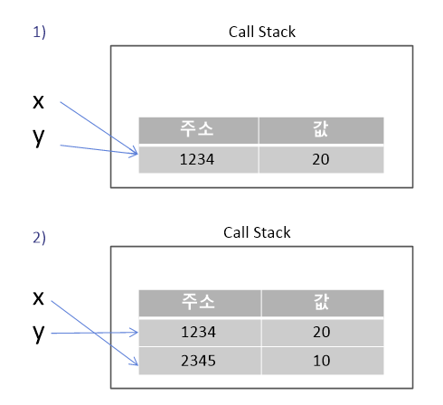

# 3. Value Types and Reference Types

## 1. Data Types
- 자료형 종류
- 자료형이 어디에 저장되는지

### 1-1. 자바스크립트 엔진 구조


- **Memory Heap** : 메모리 할당이 일어나는 곳
- **Call Stack** : 코드 실행에 따라 호출 스택이 쌓이는 곳

### 1-2. 데이터 종류

- Primitive types (원시 타입)
    - Number, String, Boolean, Symbol, undefined, null
- Reference types (참조 타입)
    - Object, Function, Array

### 1-3. 데이터의 저장


- 콜스택 : 원시 타입의 데이터 저장
- 메모리 힙 : 참조 타입(객체) 데이터 저장
- 예제
    
    ```jsx
    // primitive type value
    const a = 10;
    // reference type value
    const b = [1,2,3];
    const c = {
    	name : '카레유',
    	job : '개발자'
    }
    const d = () => {
    	// do something
    }
    ```
    
    

### 1-4. Value VS. Reference Types

- Value (Primitives)
    - 저장 : 콜 스택
    - 종류
        - Number, String, Boolean, Symbol, undefined, null
    - primitive types : 값 복사
        
        ```jsx
        let x = 20;
        let y = x; // 1) value copied 
        
        x = 10; // 2)
        
        console.log(x,',',y) // 10,20
        ```
        
        
        
- Reference Types (Objects)
    - 저장 : 메모리 힙
    - 종류
        - Object, Function, Array
    - Objects : reference 복사
        
        ```jsx
        let a = {num: 1};
        let b = a; // 1) reference 복사 
        
        a.num = 2; // 2) object 내의 값 변경, 가리키고 있는 object의 참조는 변경X
        
        console.log(a); //{num: 2}
        console.log(b); //{num: 2}
        ```
        
        
        
        ```jsx
        let a = {num: 1};
        let b = a; // reference 복사
        
        a = {}; // object의 참조 변경 -> a와 b의 참조 달라짐
        
        console.log(a); //{}
        console.log(b); //{num: 1}
        ```
        

### 1-5. pass by value, pass by reference

- 함수에 값을 넘기는 것은 항상 call stack에 있는 값을 넘김
    - primitive type
        - 파라미터
            - 함수 내부의 넘겨받은 파라미터는 외부 변수에 영향X
        
        ```jsx
        let a = 1;
        
        // val, a의 reference는 다름
        let change = (val) => {
        	val = 2;
        }
        
        change(a);
        console.log(a); //1
        ```
        
    - reference type
        - 파라미터
            - 넘겨받은 파라미터의 object의 값을 변경하면 외부에 영향O
            - 넘겨받은 파라미터에 새로운 object를 할당하면 외부 변수와 함수 내 변수와 다른 reference를 가지기 때문에 외부에 영향 X
        
        ```jsx
        let a = {num : 1};
        
        let change = (val) => {
        	val = {}; // 새로운 주소 할당하는 것
        }
        
        change(a);
        console.log(a); //{num: 1}
        ```
        
        ```jsx
        let a = {num : 1};
        
        let change = (val) => {
        	val.num = 2; 
        }
        
        change(a);
        console.log(a); //{num: 2}
        ```
        
## 2. Reference Type

* reference type ? 실제 데이터가 저장된 주소를 가리킨다.

### 2-1. Object

- 개념
    
    ```jsx
    var zero = {
      firstName: 'Zero',
      lastName: 'Cho'
    };
    ```
    
    - Object : ```{ }``` 로 감싼 덩어리
    - property : ```fistName: 'Zero'```, ```lastName : 'Cho'```
        - key : firstName, lastName
            - 문자열만 가능
        - value : 'Zero', 'Cho'
            - 어떤 값이든 상관없음
            - 함수면 **메소드** 라고 부름
- 접근
    
    ```jsx
    zero.firstName
    zero['firstName']
    ```
    
- 특징
    - 순서가 없음 : iterable하게 사용 불가
        - array로 변환해서 iterable하게 사용함
            
            ```jsx
            // 변환
            Array.from(Object)
            ```
            
- 자주 쓰이는 함수
    
    ```jsx
    const fruit = {
    	color: 'yellow',
    	name: 'banana',
    	taste: 'good',
    	location: 3
    }
    
    // values(), keys()
    const keys = fruit.keys() // ['color','name','taste','location']
    const values = fruit.values() // ['yellow','banana', 'good', 3]
    ```
    

### 2-2. Array

- 개념
    
    ```jsx
    var array = [];
    var array2 = [1,'hello',[1,2,3],{ hi : 1 }];
    ```
    
    - Array  : ```[ ]``` 로 감싼 덩어리
    - item : 배열안에 들어간 것들
        - 어떠한 값도 가능
    - Object와 다른 점
        - array는 key가 없음
        - array는 **순서**가 있음
- 접근
    
    ```jsx
    array2[0]
    ```
    
- 생성
    
    ```jsx
    var array = new Array();
    var array2 = []; // 배열 리터럴 - 권장
    ```
    
- 자주 쓰이는 함수(prototype 메서드)
    
    ```jsx
    const array = [1,2,3,4];
    const numbers = [10,20,30,40];
    const superheros = ['아이언맨', '캡틴 아메리카', '토르', '닥터 스트레인지'];
    const todos = [
      {
        id: 1,
        text: '자바스크립트 입문',
        done: true
      },
      {
        id: 2,
        text: '함수 배우기',
        done: true
      },
      {
        id: 3,
        text: '객체와 배열 배우기',
        done: true
      },
      {
        id: 4,
        text: '배열 내장함수 배우기',
        done: false
      }
    ];
    
    // map
    const arrayMap = array.map(item => item ** 2); // [1,4,9,16]
    
    // filter
    const arrayFilter = todos.filter(todo => !todo.done); // [{id:4, ~~}]
    
    // reduce
    const sum = array.reduce((accumulator, current) => accumulator + current, 0); // 11
    
    // indexOf
    const arrayIndexOf = superheros.indexOf('토르'); // 2 (찾고자 하는 아이템의 인덱스 반환)
    
    // find, findIndex
    const arrayFind = todos.find(todo => todo.id === 3); // { id: 3, text: ~~, ~~ }
    const arrayFindIndex = todos.findIndex(todo => todo.id === 3); // 2
    
    // splice : 기존 배열 변화 O
    array.splice(2, 1); // array : [1,2,4] ; index 2로부터 1개 지움
    
    // slice : 기존 배열 변화 X
    const arraySliced = array.slice(0,2); // [1,2] ; 인덱스 0부터 2전까지
    
    // shift, pop : 기존 배열 변화 O
    const shifted = numbers.shift(); // 10 - 왼쪽꺼 뺌
    const popped = numbers.pop(); // 40 - 오른쪽꺼 뺌
    ///// numbers : [20,30]
    
    ```
    

### 2-3. Function

- 개념
    
    ```jsx
    // 함수 선언
    function addOne(x) {
    	var y = x + 1;
    	return y;
    }
    
    // 함수 표현식
    var addOneFunc = function addOne(x) {
    	var y = x + 1;
    	return y;
    };
    
    // 함수 실행
    addOne(2);
    ```
    
    - 함수 선언과 함수 표현식 : 호이스팅관련 차이가 존재
    - 매개변수(parameter) : x 처럼 넘겨주는 값
    - return
        - 반환값
        - 없는 경우 undefined 반환
       
## 3. 추가 개념

- Rest parameter
    - Spread 연산자(...)를 사용하여 함수의 파라미터를 작성한 형태
    - 함수의 파라미터로 오는 값들을 **배열**로 전달받을 수 있다.
    
    ```jsx
    function foo(...restParameter){
    	return restParameter;
    }
    const rest = foo(1,2,3); // [1,2,3]
    ```
    
- argument
    - 모든 함수의 실행 시 자동으로 생성되는 객체 **유사배열객체**
    
    ```jsx
    var foo = function () {
      console.log(arguments);
    };
    foo(1, 2); // { '0': 1, '1': 2 }
    ```
    
- 객체 구조 분해
    
    ```jsx
    const hero = {
    	name : '토니 스타크',
    	actor : '로버트',
    	alias : '아이언맨'
    }
    const {alias, name, actor} = hero;
    ```

## 4. 자가 테스트

- 문제 1
    - 문제
        
        ```jsx
        function changeAgeAndReference(person) {
        	person.age = 25;
        	person = {
        		name: 'John',
        		age: 50
            };
        	return person;
        }
        
        var personObj1 = {
        	name: 'Alex',
        	age: 30
        };
        
        var personObj2 = changeAgeAndReference(personObj1);
        
        console.log(personObj1); // -> ?
        console.log(personObj2); // -> ?
        ```
        
    - 답
        
        ```jsx
        personObj1 = {
        	name: 'Alex'
        	age : 25
        }
        personObj2 = {
        	name: 'John'
        	age : 50
        }
        ```
        
- 문제 2
    - 문제
        
        ```jsx
        var a = ["1", "2", {foo:"bar"}];
        var b = a[1]; // b is now "2";
        var c = a[2]; // c now references {foo:"bar"}
        a[1] = "4";   // a is now ["1", "4", {foo:"bar"}]; b still has the value
                      // it had at the time of assignment
        a[2] = "5";   // a is now ["1", "4", "5"]; c still has the value
                      // it had at the time of assignment, i.e. a reference to
                      // the object {foo:"bar"}
        console.log(a, b, c.foo); 
        ```
        
    - 답
        
        ```jsx
        ["1", "4", "5"] "2" "bar"
        ```
        
 - 문제 3
    - 문제
        
        ```jsx
        const origin = {
        	a : 1,
        	b : 2,
        	c : 3,
        	d : {
        		q : 1,
        		w : 2,
        		e : 3
        	},
        }
        
        const changed = origin;
        
        changed.a = 4; 
        
        console.log(origin.a); 
        console.log(changed.a) 
        
        changed.d.e = 50; 
        
        console.log(changed.d.e); 
        console.log(origin.d.e); 
        ```
        
    - 답
        
        ```jsx
        4
        4
        50
        50
        ```
        
## 5. 질문

### Q1. 왜 reference value는 heap에 저장하나요?

자료 특징상 Object들은 primitive type 에 비해서 많은 데이터를 저장해야합니다.  stack 의 경우, 빠르게 접근이 가능하지만, 저장공간이 한정적입니다. 하지만, heap memory는 접근하는데 시간이 걸리지만, 많은 데이터를 저장할 수 있습니다. 따라서 많은 데이터를 저장해야하는 referenct type value는 heap에 저장하게 됩니다. 또한, Object는 크기가 고정되어 있는 원시 타입과는 다르게 데이터의 크기가 계속 변할 수 있습니다. 그래서 따로 별도의 heap이라는 저장공간을 만들어서 관리하게 됩니다.


## 참고

[콜스택/메모리힙](https://curryyou.tistory.com/276)
