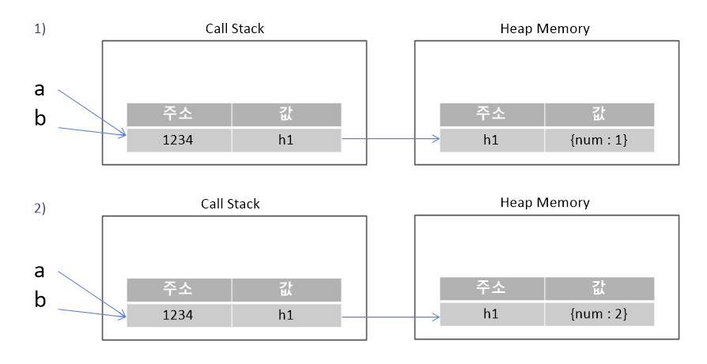

# 3. Value Types and Reference Types

## 자바스크립트 엔진 구조


- **Memory Heap** : 메모리 할당이 일어나는 곳
- **Call Stack** : 코드 실행에 따라 호출 스택이 쌓이는 곳

## 데이터 종류

- Primitive types (원시 타입)
    - Number, String, Boolean, Symbol, undefined, null
- Reference types (참조 타입)
    - Object, Function, Array

## 데이터의 저장


- 콜스택 : 원시 타입의 데이터 저장
- 메모리 힙 : 참조 타입(객체) 데이터 저장
- 예제
    
    ```jsx
    // primitive type value
    const a = 10;
    // reference type value
    const b = [1,2,3];
    const c = {
    	name : '카레유',
    	job : '개발자'
    }
    const d = () => {
    	// do something
    }
    ```
    
    
    

## Value VS. Reference Types

- Value (Primitives)
    - 저장 : 콜 스택
    - 종류
        - Number, String, Boolean, Symbol, undefined, null
    - primitive types : 값 복사
        
        ```jsx
        let x = 20;
        let y = x; // 1) value copied 
        
        x = 10; // 2)
        
        console.log(x,',',y) // 10,20
        ```
        
        
        
- Reference Types (Objects)
    - 저장 : 메모리 힙
    - 종류
        - Object, Function, Array
    - Objects : reference 복사
        
        ```jsx
        let a = {num: 1};
        let b = a; // 1) reference 복사 
        
        a.num = 2; // 2) object 내의 값 변경, 가리키고 있는 object의 참조는 변경X
        
        console.log(a); //{num: 2}
        console.log(b); //{num: 2}
        ```
        
        
        
        ```jsx
        let a = {num: 1};
        let b = a; // reference 복사
        
        a = {}; // object의 참조 변경 -> a와 b의 참조 달라짐
        
        console.log(a); //{}
        console.log(b); //{num: 1}
        ```
        

### pass by value, pass by reference

- 함수에 값을 넘기는 것은 항상 call stack에 있는 값을 넘김
    - primitive type
        - 파라미터
            - 함수 내부의 넘겨받은 파라미터는 외부 변수에 영향X
        
        ```jsx
        let a = 1;
        
        // val, a의 reference는 다름
        let change = (val) => {
        	val = 2;
        }
        
        change(a);
        console.log(a); //1
        ```
        
    - reference type
        - 파라미터
            - 넘겨받은 파라미터의 object의 값을 변경하면 외부에 영향O
            - 넘겨받은 파라미터에 새로운 object를 할당하면 외부 변수와 함수 내 변수와 다른 reference를 가지기 때문에 외부에 영향 X
        
        ```jsx
        let a = {num : 1};
        
        let change = (val) => {
        	val = {}; // 새로운 주소 할당하는 것
        }
        
        change(a);
        console.log(a); //{num: 1}
        ```
        
        ```jsx
        let a = {num : 1};
        
        let change = (val) => {
        	val.num = 2; 
        }
        
        change(a);
        console.log(a); //{num: 2}
        ```
        

## 자가 테스트

- 문제 1
    - 문제
        
        ```jsx
        function changeAgeAndReference(person) {
        	person.age = 25;
        	person = {
        		name: 'John',
        		age: 50
            };
        	return person;
        }
        
        var personObj1 = {
        	name: 'Alex',
        	age: 30
        };
        
        var personObj2 = changeAgeAndReference(personObj1);
        
        console.log(personObj1); // -> ?
        console.log(personObj2); // -> ?
        ```
        
    - 답
        
        ```jsx
        personObj1 = {
        	name: 'Alex'
        	age : 25
        }
        personObj2 = {
        	name: 'John'
        	age : 50
        }
        ```
        
- 문제 2
    - 문제
        
        ```jsx
        var a = ["1", "2", {foo:"bar"}];
        var b = a[1]; // b is now "2";
        var c = a[2]; // c now references {foo:"bar"}
        a[1] = "4";   // a is now ["1", "4", {foo:"bar"}]; b still has the value
                      // it had at the time of assignment
        a[2] = "5";   // a is now ["1", "4", "5"]; c still has the value
                      // it had at the time of assignment, i.e. a reference to
                      // the object {foo:"bar"}
        console.log(a, b, c.foo); 
        ```
        
    - 답
        
        ```jsx
        ["1", "4", "5"] "2" "bar"
        ```
        

## 참고

[콜스택/메모리힙](https://curryyou.tistory.com/276)
